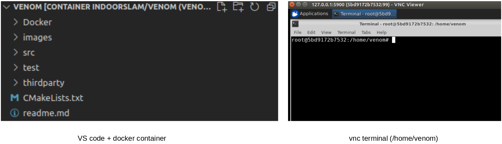
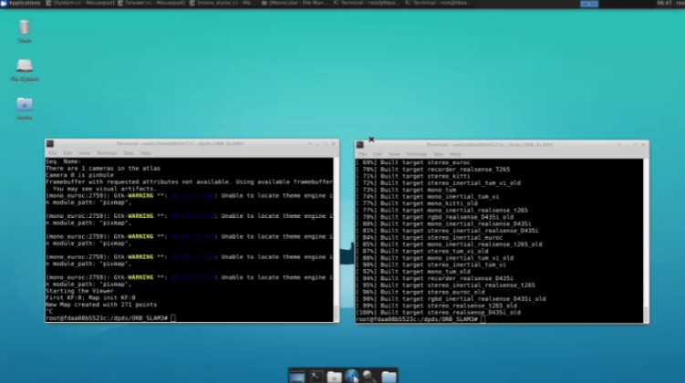

## Dockfile

Since Venom makes use of Pangolin for visualization, we link VNC Viewer to the basic environment. BTW, the docker environment can also be used for ORBSLAM3

#### 1. VNC-based Visualization 

VNC Viewer could be found [here](https://www.realvnc.com/en/connect/download/viewer/). 

#### 2. docker 

**1.1 docker image**

```
cd  Docker
docker build -t indoorslam/venom .
```
**docker image ls**, you can find the built image. 


**1.2 docker container**

To use local VS Code, we share local documents to the docker container by 5900 Port.

```
# local address for the documents: /home/your_name/Documents/VENOM/
docker run -itd --name=venom-simulation -v /home/yanyan/Documents/VENOM-master:/home/VENOM/ -p 5900:5900 -e PASSWORD=password indoorslam/venom 
```

When you use your VS Code IDE to connect the container, you will see the left image. You also could see the right one, when you open the **venom folder** in your vnc terminal.



```
# input the following address on your VNC Viewer
127.0.0.1:5900 
```


