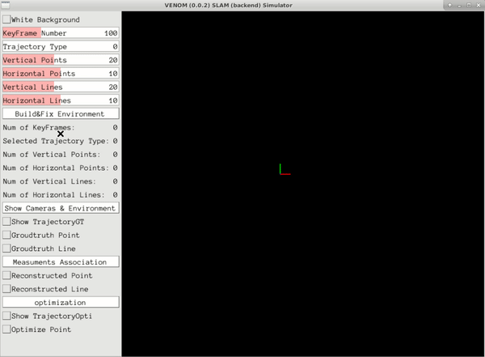
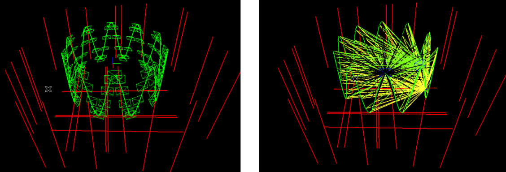

<h1 align="center">
  Venom
</h1> 
<h3 align="center">
 Simulator Software for Pose Estimation
</h3>
<p align="center">
  <a href="https://eccv2022.ecva.net"></a>
  <a href="https://arxiv.org/pdf/2207.10008.pdf"></a>
  <a href="https://TORELEASE"></a>
  <a href="https://github.com/yanyan-li/VENOM/blob/master/LICENSE">
    </a>
    <a href="https://github.com/yanyan-li/VENOM/blob/master/version.md"></a>
</p>

**Authors:** Yanyan Li and Federico Tombari

A simulator is a super important tool for testing SLAM modules, especially for newly proposed ideas, as it is easy to check the validity of your ideas in a controlled environment. 

## 1. License

Venom Simulator is released under [GNU General Public License v3.0](https://github.com/yanyan-li/VENOM/blob/master/LICENSE). The closed-source version of Venom used in SLAM systems for commercial purposes, please contact the authors: @Yanyan or @Federico. If you use this work in your academic work, please cite: 

```
@article{li2022graph,
  title={E-Graph: Minimal Solution for Rigid Rotation with Extensibility Graphs},
  author={Li, Yanyan and Tombari, Federico},
  journal={arXiv preprint arXiv:2207.10008 (ECCV2022)},
  year={2022}
}
```

## 2. Prerequisites 

We have tested the library in **Ubuntu 18.04**, but it should be easy to compile in other platforms.

#### 2.1 Your local environment

#####  C++11 or C++0x Compiler

We use the new thread and chrono functionalities of C++11.

#### Pangolin

We use [Pangolin](https://github.com/stevenlovegrove/Pangolin) for visualization and user interface. Dowload and install instructions can be found at: https://github.com/stevenlovegrove/Pangolin.

#### OpenCV

We use [OpenCV](http://opencv.org/) to manipulate images and features. Dowload and install instructions can be found at: [http://opencv.org](http://opencv.org/). **Required at leat 3.0. Tested with OpenCV 3.2.0 and 4.4.0**.

#### Eigen3

Required by g2o (see below). Download and install instructions can be found at: [http://eigen.tuxfamily.org](http://eigen.tuxfamily.org/). **Required at least 3.1.0**.

#### 2.2 Prepared Docker Image 

Clone the repo, and it is easy to build your own image and container based on the dockerfile proposed in the **Docker** folder. The proposed [docker environment](Docker/readme.md) contains the following  libs: Pangolin, OpenCV, Eigen and minor supported libraries.   

**Choices for optimization:**

*Popular optimization libraries including ceres, gtsam and g2o can be selected here based on your particular preferences.* 
Optimization libraries are not installed in advance, but suggestions for installing can be found  [here](thirdparty/readme.md).

## 3. Building Venom Simulator and Examples 

Red point are ground truth **landmarks**, while reconstructed **mappoints** generated from noisy measurements are yellow. 

Trajectory: Cycle, Sphere and so on.

##### 2.0 Interface of the system

To help users build environments more conveniently, the following software interface is made to design your synthetic environment in a super simple way.

<div align ="center">
	
</div>

You could select the numbers of camera frames, point and line landmarks in the environment via several swipe and click actions as shown in this figure. 

The commands you need are:

```
cd venom
mkdir build
cd build 
cmake ..
make
../bin/main_entrance 
```


##### 2.1 Show Env

```
cd venom
mkdir build
cd build 
cmake ..
make
../bin/show_estimator_env 
```


<h5 align="center">
    Environment 1.
</h5> 


<h5 align="center">
    Environment 2.
</h5> 
<h5 align="center">
    x: frame_id; y: Measurements detected by each frame.(Left: mappoints; Right: maplines. )
</h5> 


<h5 align="center">
    Figure. Left image shows a trajectory, while venom anchors are detected in the right image. 
</h5> 




##### 2.2 Optimization map points 

Commands for testing the simulator

```
cd venom
mkdir build
cd build
cmake ..
make
cd ../bin
./test_pointBA
```


### Related Publications:

If you use Venom in an academic work, please cite:

```
inproceedings{Li2021PlanarSLAM,
  author = {Li, Yanyan and Yunus, Raza and Brasch, Nikolas and Navab, Nassir and Tombari, Federico},
  title = {RGB-D SLAM with Structural Regularities},
  year = {2021},
  booktitle = {2021 IEEE international conference on Robotics and automation (ICRA)},
 }
```
```
inproceedings{Li2020SSLAM,
  author = {Li, Yanyan and Brasch, Nikolas and Wang, Yida and Navab, Nassir and Tombari, Federico},
  title = {Structure-SLAM: Low-Drift Monocular SLAM in Indoor Environments},
  year = {2020},
  booktitle = {IEEE/RSJ International Conference on Intelligent Robots and Systems (IROS)},
 }
```

```
@article{li2022graph,
  title={E-Graph: Minimal Solution for Rigid Rotation with Extensibility Graphs},
  author={Li, Yanyan and Tombari, Federico},
  journal={arXiv preprint arXiv:2207.10008 (ECCV2022)},
  year={2022}
}
```


### Acknowledgement

