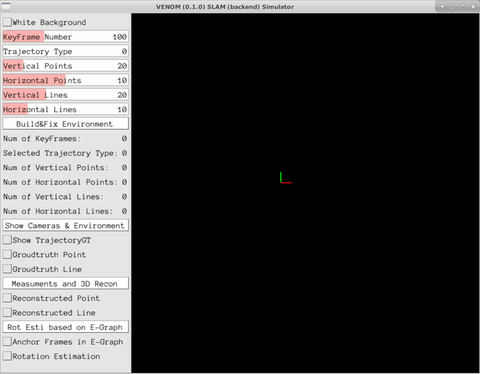
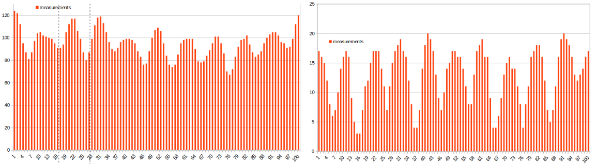
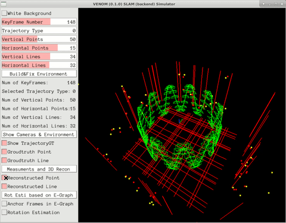
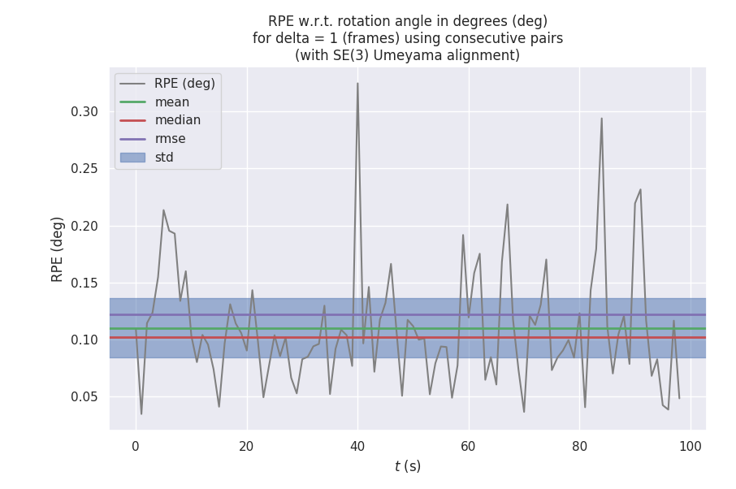

<h1 align="center">
  Venom
</h1> 
<h3 align="center">
 Simulator Software for Pose Estimation
</h3>
<p align="center">
  <a href="https://eccv2022.ecva.net"></a>
  <a href="https://arxiv.org/pdf/2207.10008.pdf"></a>
  <a href="https://TORELEASE"></a>
  <a href="https://github.com/yanyan-li/VENOM/blob/master/LICENSE">
    </a>
    <a href="https://github.com/yanyan-li/VENOM/blob/master/version.md"></a>
</p>
**Authors:** Yanyan Li, Liang Zhao and Federico Tombari

A simulator is a super important tool for testing SLAM modules, especially for newly proposed ideas, as it is easy to check the validity of your ideas in a controlled environment. 

## 1. License

Venom Simulator is released under [GNU General Public License v3.0](https://github.com/yanyan-li/VENOM/blob/master/LICENSE). The closed-source version of Venom used in SLAM systems for commercial purposes, please contact the authors: @Yanyan or @Federico. If you use this work in your academic work, please cite: 

```
@article{li2022graph,
  title={E-Graph: Minimal Solution for Rigid Rotation with Extensibility Graphs},
  author={Li, Yanyan and Tombari, Federico},
  journal={arXiv preprint arXiv:2207.10008 (ECCV2022)},
  year={2022}
}
```

## 2. Prerequisites 

We have tested the library in **Ubuntu 18.04**, but it should be easy to compile in other platforms.

#### 2.1 Your local environment

#### C++11 or C++0x Compiler

We use the new thread and chrono functionalities of C++11.

#### Pangolin

We use [Pangolin](https://github.com/stevenlovegrove/Pangolin) for visualization and user interface. Dowload and install instructions can be found at: https://github.com/stevenlovegrove/Pangolin.

#### OpenCV

We use [OpenCV](http://opencv.org/) to manipulate images and features. Dowload and install instructions can be found at: [http://opencv.org](http://opencv.org/). **Required at leat 3.0. Tested with OpenCV 3.2.0 and 4.4.0**.

#### Eigen3

Required by g2o (see below). Download and install instructions can be found at: [http://eigen.tuxfamily.org](http://eigen.tuxfamily.org/). **Required at least 3.1.0**.

#### 2.2 Prepared Docker Image 

Clone the repo, and it is easy to build your own image and container based on the dockerfile proposed in the **Docker** folder. The proposed [docker environment](Docker/readme.md) contains the following  libs: Pangolin, OpenCV, Eigen and minor supported libraries.   

**Choices for optimization:**

*Popular optimization libraries including ceres, gtsam and g2o can be selected here based on your particular preferences.* 
Optimization libraries are not installed in advance, but suggestions for installing can be found  [here](thirdparty/readme.md).

## 3. Building Venom Simulator and Examples 

Clone the repository:

```
git clone https://github.com/yanyan-li/VENOM.git
```

After making sure you have the environment with all required dependencies (see section 2), the following commands are used to build the system.

```
cd venom
mkdir build
cd build 
cmake ..
make
../bin/main_entrance 
```

Then you will see **libVenomSimulator.so** at lib folder as well as the following software interface.

<div align ="center">
	
</div>

#### 3.1 Build trajectory and landmarks

To help users build environments more conveniently, the interface is made to design your synthetic environment in a super simple way. First, you could select the numbers of **camera frames**, **points** and **lines** in the environment via several swipe and click actions as shown in this figure.  

After determining those parameters, please click the "**Build&Fix Environment**" button to initialize the system. You will then see your own environment by clicking the "**Show Camera & Environment**" button. Specifically, red points and lines are ground truth **landmarks**, and green cameras are ground truth **poses**.



<h6 align="center">
Figure. x-axis: frame_id; y-axis: measurements detected by each frame. (Left: mappoints; Right: maplines.)
</h6> 

#### 3.2 Reconstruct mappoints based on measurements

*Measurements*.  When we reproject environment information into camera frames, we can obtain ground truth measurements for simulating detected features (yellow color) by adding noise.

<div align ="center">
	
</div>

#### 3.3  Extensibility Graph 

Extensibility Graph (E-Graph) is proposed by [our paper](https://arxiv.org/pdf/2207.10008.pdf). The idea of the E-Graph is very simple, which aims to connect frames without overlaps. 

<div align ="center">
	
</div>

As shown, the blue cameras were used to mark anchors because they first detected non-parallel direction vectors (here called venom). Edges between an anchor and other frames mean that the same venom was detected by those frames.

## 4. Evaluation 

Rotation between **two remote frames that maybe have no overlaops** based on Venom.

After the process, you will find "estimation.txt" and "ground_truth.txt" in the build folder. Then, the **estimated rotation** based on venom can be evaluated via [EVO](https://github.com/MichaelGrupp/evo).

<div align ="center">
	
</div>


