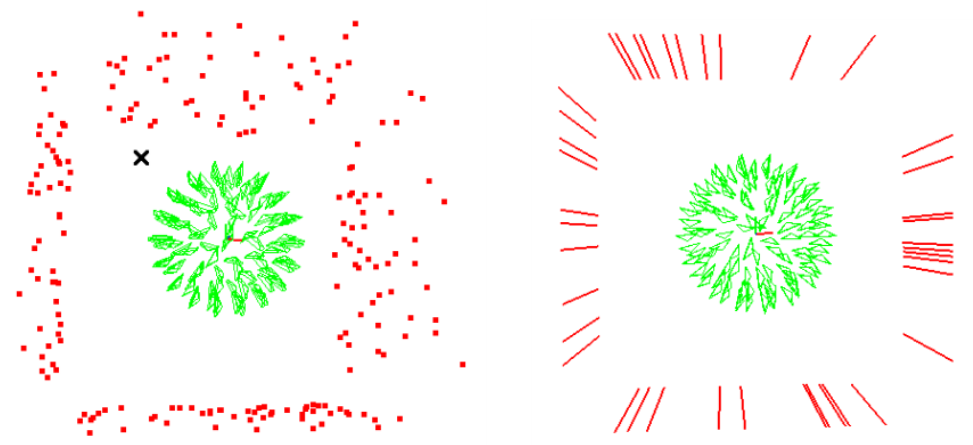
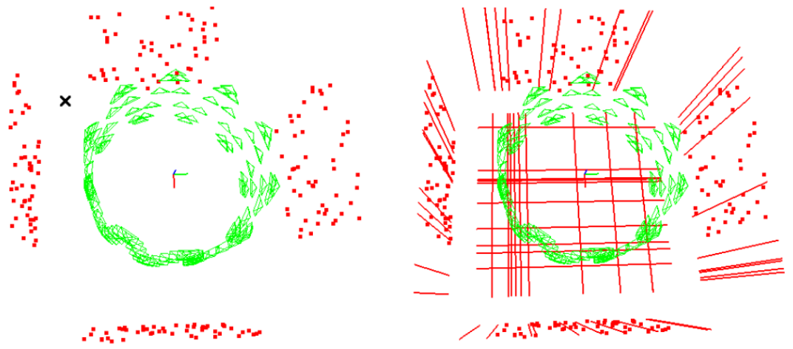
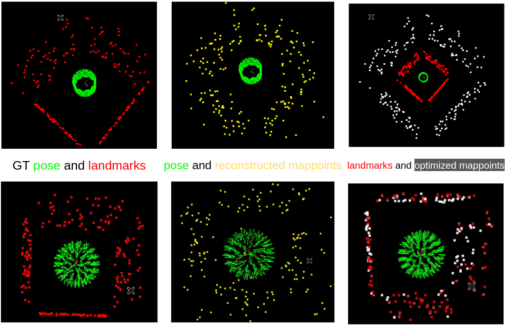

<h1 align="center">
  Venom
</h1> 
<h3 align="center">
 Simulator Software for Pose Estimation
</h3>
<p align="center">
  <a href="https://eccv2022.ecva.net"></a>
  <a href="https://arxiv.org/pdf/2207.10008.pdf"></a>
  <a href="https://TOOD"></a>
  <a href="https://arxiv.org/pdf/2010.07997.pdf"></a>
  <a href="https://arxiv.org/pdf/2008.01963.pdf"></a>
  <a href="https://medium.com/@mgalkin/knowledge-graphs-iclr-2020-f555c8ef10e3"></a>
  <a href="https://">
    
  </a>
    <a href="https://github.com/yanyan-li/VENOM/blob/master/version.md"></a>
</p>


A simulator is a super important tool for testing SLAM modules, especially for newly proposed ideas, as it is easy to check the validity of your ideas in a controlled environment.

#### 1. Prerequisites based on Docker 

Clone the repo, and it is easy to build your own image and container based on the Dockerfile proposed in the **Docker** folder.
The proposed [docker environment](Docker/readme.md) contains the following  libs.
#### Installed environment
Pangolin, OpenCV, Eigen and minor libs have been installed in already.  

#### Choices for optimization.
*Popular optimization libraries including ceres, gtsam and g2o can be selected here based on your particular preferences.* 
Optimization libraries are not installed in advance, but suggestions for installing can be found  [here](thirdparty/readme.md).

#### 2. Simulation introduction 

Red point are ground truth **landmarks**, while reconstructed **mappoints** generated from noisy measurements are yellow. 

Trajectory: Cycle, Sphere and so on.

##### 2.1 Show Env

```
cd venom
mkdir build
cd build 
cmake ..
make
../bin/show_estimator_env 
```




<h5 align="center">
    Environment 1.
</h5> 




<h5 align="center">
    Environment 2.
</h5> 
<h5 align="center">
    x: frame_id; y: Measurements detected by each frame.(Left: mappoints; Right: maplines. )
</h5> 


##### 2.2 Optimization map points 

Commands for testing the simulator

```
cd venom
mkdir build
cd build
cmake ..
make
cd ../bin
./test_pointBA
```




### Related Publications:

If you use Venom in an academic work, please cite:

```
inproceedings{Li2021PlanarSLAM,
  author = {Li, Yanyan and Yunus, Raza and Brasch, Nikolas and Navab, Nassir and Tombari, Federico},
  title = {RGB-D SLAM with Structural Regularities},
  year = {2021},
  booktitle = {2021 IEEE international conference on Robotics and automation (ICRA)},
 }
```
```
inproceedings{Li2020SSLAM,
  author = {Li, Yanyan and Brasch, Nikolas and Wang, Yida and Navab, Nassir and Tombari, Federico},
  title = {Structure-SLAM: Low-Drift Monocular SLAM in Indoor Environments},
  year = {2020},
  booktitle = {IEEE/RSJ International Conference on Intelligent Robots and Systems (IROS)},
 }
```

```
@article{li2022graph,
  title={E-Graph: Minimal Solution for Rigid Rotation with Extensibility Graphs},
  author={Li, Yanyan and Tombari, Federico},
  journal={arXiv preprint arXiv:2207.10008 (ECCV2022)},
  year={2022}
}
```


### Acknowledgement

